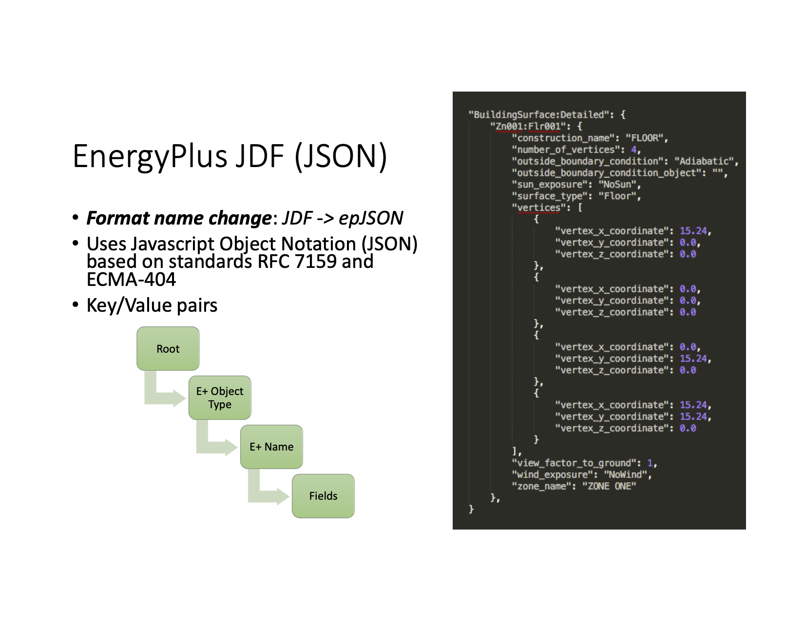

=================
Development Notes
=================

This a a fairly free form document exploring the directions in which early development could go. It is also a repository for ideas that may or may not be used.  

This section may not be needed once the code gets more stable. Right now this a way to document these ideas so that they don't get lost as we make pragmatic decisions.

Munch classes for epJSON
------------------------

From a `presentation <http://web.eecs.utk.edu/~jnew1/presentations/2017_IBPSA_JSON.pdf>`_. at the buildsim conference in 2017 

This opens up the possibilty of having three classes:

- EPMunch -> general
    - Root
    - E+ Object type
- EPObject -> for items got from EPJ.epobjects()
    - E+ Name
    - Fields
- EPListinObject -> for lists in EPObject

The class heirarchy would be::

    Munch -> EPMunch -> EPObject
             EPMunch -> EPListinObject

Right now we have only ``EPMunch`` for all of the above.

The initial benifit in having the three classes is that is eases the ``__repr__`` (and ``__str__``) code. Right now there are too many if statements. The same for ``__setattr__`` and ``__setitem__``. It is not a critical change, since everything works right now.

Opening files in eppy3000 code
------------------------------

Based on current discussion in issues
